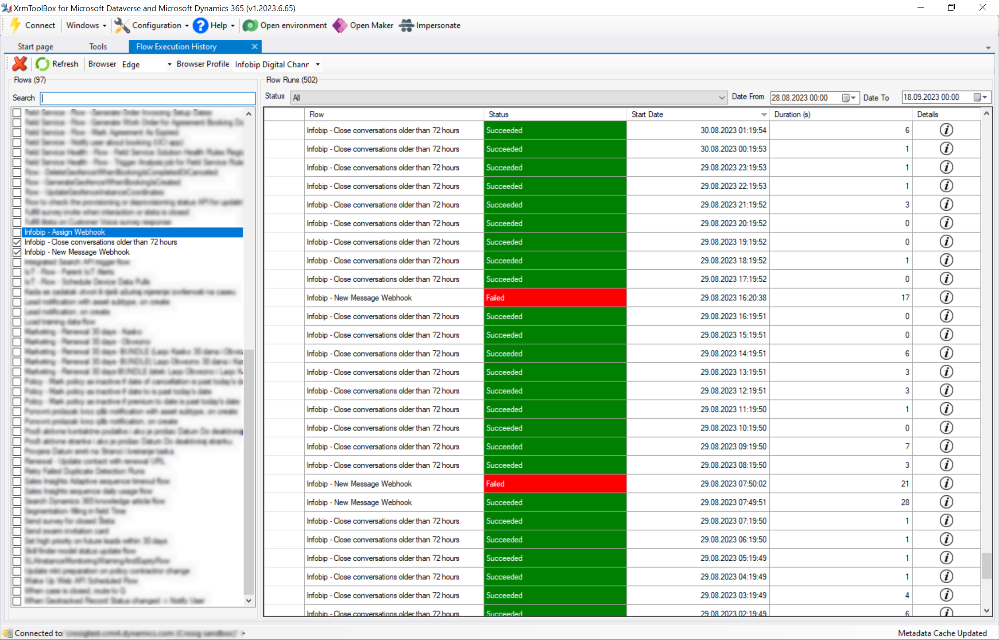

# Flow Execution History for [XrmToolBox](http://www.xrmtoolbox.com)

 

XrmToolBox tool that allows you to browse Power Automate flow runs by applying multiple filters including multiple flows at the same time.

## Preview

## Features

### Multiple Flows

You are able to filter flow runs against multiple flows at the same time, so you can see everything in one place.

## Time filters

FIlter out flow runs for a period of time instead of constantly loading next page like we are used to in run history on Power Automate portal.

## Browser and profiles

Select browser and browser profile that will be used when opening run details link.
